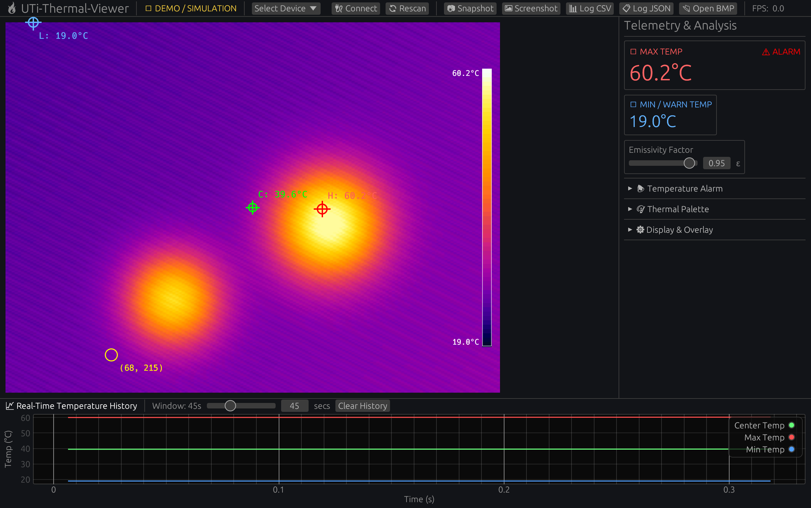

# 🔥 uti-thermal-viewer

[](https://www.rust-lang.org/)
[](https://github.com/emilk/egui)
[](LICENSE-MIT)
[]()

An open-source, high-performance **Rust** desktop application, driver, and analysis toolkit for the **UNI-T UTi260B** handheld thermal imaging camera.

Featuring an interactive native GUI built with [`egui`](https://github.com/emilk/egui) / [`eframe`](https://crates.io/crates/eframe) (Wgpu renderer), live radiometric telemetry extraction, real-time temperature trend graphing via [`egui_plot`](https://crates.io/crates/egui_plot), false-color palettes, offline SD card `.bmp` radiometric analysis, and headless CLI tools.

---



---

## ⚡ Features

### 🖥️ Native `egui` Desktop Application
- **Live 25 FPS Video Viewport**: Scalable, aspect-ratio-preserved thermal stream with zero-copy YUYV conversion.
- **Dynamic Crosshair Overlays**:
  - 🔴 **Hot Spot Tracker (`H:`)**: Automatically pinpoints and labels the hottest pixel in real-time.
  - 🔵 **Cold Spot Tracker (`L:`)**: Automatically pinpoints and labels the coldest pixel.
  - 🟢 **Center Reticle (`C:`)**: Fixed center measurement with live temperature readout.
  - 🟡 **Interactive Hover Inspector**: Hover anywhere on the thermal image with your mouse to inspect exact pixel coordinates and intensity values.
- **Real-Time Temperature History Plot**: Rolling multi-channel temperature graph (`egui_plot`) displaying Max, Min, and Center temperatures over an adjustable time window (10s to 120s).
- **Thermal Colorbar Scale**: Vertical false-color gradient bar with dynamic upper and lower temperature calibration tick marks.
- **High-Temperature Alarm**: User-configurable alarm threshold with instant visual warning badges and status alerts.
- **False-Color Palettes**: Instant one-click switching between **Ironbow**, **Rainbow**, **White Hot**, **Black Hot**, and **Red Hot (Hotspots)**.
- **Built-in Thermal Simulation / Demo Mode**: Realistic synthetic thermal PCB scene with drifting hotspots when the camera is not plugged in, so you can test all features offline.
- **One-Click Snapshots, Screenshots & Data Logging**: Capture timestamped thermal sensor PNGs (`📷 Snapshot`), full application window screenshots (`🖼 Screenshot`), and stream live telemetry logs to **CSV** (`📊 Log CSV`) or **JSON Lines** (`📋 Log JSON`).
- **Offline BMP Analysis Modal**: Load `.bmp` radiometric snapshots directly from the camera's SD card, inspect raw sensor data, and export clean PNGs, CSV temperature matrices, and JSON radiometric datasets.

### 🧰 Headless CLI & Automation
- **Camera Auto-Discovery**: Detects connected UTi-260B devices across Linux (V4L2), Windows (MSMF), and macOS (AVFoundation).
- **Console Telemetry Streamer**: High-speed console monitor printing live FPS, Max Temp, Warn Temp, and Emissivity.
- **Terminal TrueColor Preview**: View live thermal imaging directly in your terminal using 24-bit ANSI colors (works over SSH and in headless environments!).
- **Scriptable Captures**: Single-shot captures saving PNG/BMP images and JSON telemetry files.

---

> [!NOTE]
> **Camera Configuration**: In the camera device menu, ensure **USB Mode** is set to **"PC Camera"**.

> [!WARNING]
> **Hardware Power Warning**: EEVblog hardware testing reports that the UTi260B internal power regulation circuitry can be damaged by certain USB-C PD fast chargers. Always connect the camera using a standard 5V-only USB-A to USB-C cable.

---

## 🚀 Quickstart

### Launch the GUI Application
```bash
cargo run --release
```
*(If no camera is connected, the app automatically starts in **Demo / Simulation Mode** with realistic thermal scene dynamics so you can explore all features immediately!)*

### Take an Automated Window Screenshot
```bash
# Save timestamped GUI screenshot to current directory (e.g. screenshot_20260926_213725.png)
cargo run --release -- --screenshot

# Or save timestamped screenshot to the assets/ directory
cargo run --release -- --screenshot assets/
```

---

## ⌨️ CLI Usage

The headless CLI tool is ideal for scripts, cron jobs, and headless Linux servers:

```bash
# 1. Scan for connected thermal cameras
cargo run --bin uti-thermal-viewer-cli -- detect

# 2. Live telemetry dashboard in console with continuous CSV / JSON logging
cargo run --bin uti-thermal-viewer-cli -- stream --csv telemetry.csv --json telemetry.jsonl

# 3. Live 24-bit TrueColor thermal preview directly in terminal
cargo run --bin uti-thermal-viewer-cli -- preview --width 80 --height 30

# 4. Capture a single snapshot to PNG + telemetry to JSON & CSV
cargo run --bin uti-thermal-viewer-cli -- capture -o thermal.png --json telemetry.json --csv telemetry.csv

# 5. Parse saved SD card BMP, export clean thermal PNG, CSV matrix, & JSON dataset
cargo run --bin uti-thermal-viewer-cli -- parse-bmp snapshot.bmp --export-png clean.png --export-csv temps.csv --export-json dataset.json
```

---

## 📦 Rust Library Usage

Add `uti-thermal-viewer` to your `Cargo.toml`:

```toml
[dependencies]
uti-thermal-viewer = { path = "../uti-thermal-viewer" }
```

### Live Streaming and Telemetry
```rust
use uti_thermal_viewer::{UtiCamera, Result};

fn main() -> Result<()> {
    // Automatically find and open the UTi-260B
    let mut camera = UtiCamera::open_default()?;

    // Read next frame
    let frame = camera.next_frame()?;

    if let Some(telem) = &frame.telemetry {
        println!("Max: {:.1}°C ({:.1}°F)", telem.max_temp_c, telem.max_temp_f());
        println!("Warn: {:.1}°C, Emissivity: {:.2}", telem.warn_temp_c, telem.emissivity);
    }

    // Save as PNG or convert to RGB
    frame.save_png("live_snapshot.png")?;
    let _rgb_image = frame.to_rgb_image();

    Ok(())
}
```

### Parsing Recorded BMP Radiometric Images
```rust
use uti_thermal_viewer::{UtiBmpImage, Palette, Result};

fn main() -> Result<()> {
    let bmp = UtiBmpImage::from_file("sample.bmp")?;

    println!("Temp Range: {:.1}°C - {:.1}°C", bmp.temp_min, bmp.temp_max);

    // Export per-pixel temperature CSV
    let csv = bmp.export_temperature_csv();
    std::fs::write("matrix.csv", csv)?;

    // Render clean image without on-screen UI
    let clean_img = bmp.render_clean_image(Some(Palette::Iron));
    clean_img.save("clean_thermal.png")?;

    Ok(())
}
```

---

## 📜 License

Dual-licensed under either of:
- Apache License, Version 2.0 ([LICENSE-APACHE](LICENSE-APACHE))
- MIT license ([LICENSE-MIT](LICENSE-MIT))
